# Hi, I'm 0xfe 👋

> **Software Engineering @ SEU '27 | AI Research**

### 🚀 What I'm doing
* 🔍 **[ValiRef](https://github.com/Gianthard-cyh/ValiRef)**: Building an agentic hallucination detector for LLM citations. Making bibliographic integrity a thing again.
* 🎞️ **Visuals**: Capturing the world through **Analog Cameras** and **Sony A7C**. Post-processing life in **DaVinci Resolve**.

### 🏗️ Stacks

| Domain | Stack |
| :--- | :--- |
| **Development** | `lazy.nvim` • `Vue` • `Nuxt.js` |
| **Visual Arts** | `DaVinci Resolve` • `Figma` • `Adobe Suite` |
| **Infrastructure** | `Manjaro Linux` • `ThinkPad T14` |

### 📊 Stats

---

### 📬 Connectivity
[Email](chenyuheng@seu.edu.cn)

<!--
**Gianthard-cyh/Gianthard-cyh** is a ✨ _special_ ✨ repository because its `README.md` (this file) appears on your GitHub profile.

Here are some ideas to get you started:

- 🔭 I’m currently working on ...
- 🌱 I’m currently learning ...
- 👯 I’m looking to collaborate on ...
- 🤔 I’m looking for help with ...
- 💬 Ask me about ...
- 📫 How to reach me: ...
- 😄 Pronouns: ...
- ⚡ Fun fact: ...
-->
